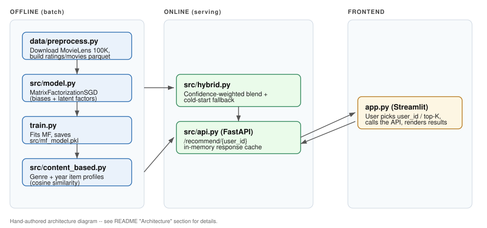

# 🎬 Recommendation System from Scratch

[](https://www.python.org/)
[](LICENSE)
[](https://github.com/HarshitJoshi-KGP/hybrid-movie-recommender-numpy/actions/workflows/ci.yml)
[](https://fastapi.tiangolo.com/)
[](https://streamlit.io/)
[](https://www.docker.com/)

> **Portfolio project** — a hybrid movie recommender built for AI/ML/DS internship
> and research applications. Matrix factorization is implemented **from scratch
> with NumPy** (no `surprise` / `implicit`), so every gradient update is
> explainable line-by-line rather than hidden behind a library call.

---

## Table of Contents
- [Overview](#overview)
- [Features](#features)
- [Architecture](#architecture)
- [Folder Structure](#folder-structure)
- [Algorithms](#algorithms)
- [Tech Stack](#tech-stack)
- [Installation](#installation)
- [Training](#training)
- [Running the Streamlit demo](#running-the-streamlit-demo)
- [Running the FastAPI server](#running-the-fastapi-server)
- [API Endpoints](#api-endpoints)
- [Evaluation](#evaluation)
- [Example Outputs](#example-outputs)
- [Testing](#testing)
- [Known Limitations](#known-limitations)
- [Future Improvements](#future-improvements)
- [License](#license)
- [Author](#author)

---

## Overview

Implements **Matrix Factorization using SGD** (with per-user/per-item biases
and L2 regularization), combined with a **genre-based content model** in a
**confidence-weighted hybrid** that handles cold-start users — all trained
and evaluated on [MovieLens 100K](https://grouplens.org/datasets/movielens/100k/).

**Key differentiators:**
- The core SGD update rule (biases + latent factors) is written manually — fully explainable in interviews, no black-box library.
- The content model uses MovieLens's real genre flags (`u.item`) plus release year, not just movie titles.
- **Confidence-weighted hybrid blending:** `hybrid_score = weight * collaborative_score + (1 - weight) * content_score`, where `weight` grows with how many ratings a user/item has — a brand-new user or item leans on the content score instead of an unreliable collaborative one.
- **Cold-start fallback:** users with zero interaction history get pure content-based recommendations built from their stated preferences.
- **Time-based train/test split** (train on older ratings, test on newer) instead of a random split, which avoids leaking future information into training.
- FastAPI backend (single + batch recommend, similar-items, explainability) with a TTL-expiring LRU cache + Streamlit demo frontend + Docker support.

## Features
- 🧮 From-scratch SGD matrix factorization (biases + latent factors + L2 reg.)
- 🎭 Genre + release-year content-based similarity model
- 🔀 Confidence-weighted hybrid blending (collaborative + content)
- ❄️ Cold-start handling for users with no rating history
- ⏱️ Time-based train/test split for realistic offline evaluation
- 📊 Rating-prediction metrics (RMSE, MAE) and ranking metrics (Precision@K, NDCG@K)
- 🔍 Explainable recommendations: each result can carry the collab/content scores, blend weight, dominant latent factor, and matching genres (`explain=True`)
- 📦 Batch recommendation endpoint (`POST /recommend/batch`) for many users in one call
- 🎯 "Similar items" endpoint (`GET /similar/{movie_id}`) — item-to-item content similarity, no user required
- ⚡ FastAPI serving layer with a bounded, TTL-expiring LRU response cache
- 🖥️ Streamlit demo UI (including a cold-start mode toggle)
- 🐳 Docker + docker-compose (API + Streamlit as two services from one image)
- 🔬 Lightweight hyperparameter grid search with CSV experiment tracking (`scripts/tune.py`)
- ✅ Pytest suite (unit tests + an optional live-API integration test)
- 🤖 GitHub Actions CI running the test suite on every push

## Architecture



- **Offline:** `data/preprocess.py` (download + parquet) → `src/model.py` (MF training) + `src/content_based.py` (genre-based item profiles) → `train.py` (fits and saves `src/mf_model.pkl`)
- **Online:** `src/hybrid.py` (blending + cold-start) served through `src/api.py` (FastAPI, with response caching)
- **Frontend:** `app.py` (Streamlit dashboard, calls the API)

## Folder Structure
```
.
├── app.py                     # Streamlit demo frontend
├── train.py                   # Training entry point (see "Training" for why this matters)
├── Dockerfile                 # Single image, used for both API and Streamlit services
├── docker-compose.yml         # Wires the API + Streamlit services together
├── .dockerignore
├── pytest.ini                 # Pytest configuration
├── requirements.txt           # Runtime dependencies
├── requirements-dev.txt       # Runtime + test dependencies
├── LICENSE
├── .gitignore
├── data/
│   ├── __init__.py
│   ├── preprocess.py           # Loads cached parquet if present, else downloads MovieLens 100K and builds it
│   ├── ratings.parquet          # generated -- not committed, see .gitignore
│   └── movies.parquet           # generated -- not committed, see .gitignore
├── src/
│   ├── __init__.py
│   ├── model.py                 # MatrixFactorizationSGD (from-scratch SGD + biases + L2)
│   ├── content_based.py          # Genre + year based content similarity
│   ├── hybrid.py                  # Confidence-weighted blending + cold-start + explainability
│   ├── evaluate.py                 # Time-based split, RMSE/MAE, Precision@K, NDCG@K
│   ├── api.py                       # FastAPI serving layer: recommend, batch, similar, TTL+LRU cache
│   └── mf_model.pkl                  # generated -- not committed, see .gitignore
├── scripts/
│   ├── __init__.py
│   └── tune.py                  # Hyperparameter grid search + CSV experiment tracking
├── experiments/
│   └── experiment_log.csv      # generated by scripts/tune.py -- one row per run (config + metrics)
├── tests/
│   ├── __init__.py
│   ├── test_smoke.py            # Unit tests: data load, MF predict, hybrid recommend, explain, similarity
│   └── test_api_integration.py   # Integration tests against a live API (auto-skips if not running)
├── assets/
│   ├── architecture.svg          # Architecture diagram (this README embeds it)
│   └── screenshots/               # Placeholder + checklist for real screenshots
├── docs/                       # Reserved for future design notes / ADRs
├── notebooks/                  # loss_curve.png + evaluation_metrics.png (see "Example Outputs"), generated by train.py / scripts
└── .github/workflows/ci.yml    # GitHub Actions: installs deps, preprocesses data, runs tests
```

## Algorithms

| Component | Approach |
|---|---|
| Collaborative filtering | Matrix Factorization trained with SGD: `pred = global_bias + user_bias + item_bias + user_factors · item_factors`, updated with L2-regularized gradients over shuffled epochs |
| Content-based filtering | Cosine similarity over 19 real MovieLens genre flags + a down-weighted normalized release year |
| Hybrid blending | `weight = f(user_rating_count, item_rating_count)` grows toward 1 as both counts grow, so `hybrid_score = weight * MF_score + (1 - weight) * content_score` |
| Cold-start | New users get pure content-based recommendations from a stated "liked movies" list; the hybrid model detects `user_id not in mf_model.user_map` and routes accordingly |

## Tech Stack
- **Modeling:** NumPy, pandas, scikit-learn (cosine similarity only — no `surprise`/`implicit`)
- **Serving:** FastAPI, Uvicorn, Pydantic
- **Frontend:** Streamlit
- **Storage:** Parquet (via PyArrow)
- **Testing:** Pytest
- **CI:** GitHub Actions

## Installation
```bash
git clone https://github.com/HarshitJoshi-KGP/hybrid-movie-recommender-numpy.git
cd hybrid-movie-recommender-numpy

python -m venv venv
source venv/bin/activate   # Windows: venv\Scripts\activate

pip install -r requirements-dev.txt   # or requirements.txt if you don't need pytest
```

## Training
```bash
# 1. Preprocess data (uses data/ratings.parquet + data/movies.parquet if they
#    already exist; otherwise downloads MovieLens 100K into data/ml-100k/
#    and builds them)
python -m data.preprocess

# 2. Train the MF model (~25-30s on 100K ratings, 15 epochs)
python train.py

# 3. Evaluate (prints the tables in "Evaluation" below)
python -m src.evaluate
```

> **Train with `python train.py`, not `python -m src.model`.** Python's `pickle`
> records a class under whichever module was `__main__` at save time. Training
> by running `src/model.py` directly would save the model as
> `__main__.MatrixFactorizationSGD`, which only loads back from that same
> entry point — that broke the FastAPI server (`AttributeError: Can't get
> attribute 'MatrixFactorizationSGD' on <module '__main__'...>`) the first
> time this got run outside of training. `train.py` imports the class
> normally (`src.model.MatrixFactorizationSGD`) so the saved model loads
> cleanly from `api.py`, `evaluate.py`, the test suite, or anywhere else.

## Running the Streamlit demo
```bash
# In one terminal: the API must be running first (see below)
uvicorn src.api:app --reload --port 8000

# In another terminal
streamlit run app.py
```
Pick a `user_id` (1-943) and a top-K value in the sidebar, or toggle
**Cold-Start Mode** to simulate a brand-new user with a small "liked movies"
list instead.

## Running the FastAPI server
```bash
uvicorn src.api:app --reload --port 8000
```
Swagger UI is then available at `http://127.0.0.1:8000/docs`.

## Running with Docker
```bash
python train.py            # produces src/mf_model.pkl on the host first --
                            # the containers mount it read-only rather than
                            # retraining inside the image
docker compose up --build
```
- API: `http://localhost:8000/docs`
- Streamlit: `http://localhost:8501`

Both services build from the same `Dockerfile` and mount `data/` and
`src/mf_model.pkl` read-only from the host, so re-running `python train.py`
on the host and restarting the containers picks up a retrained model
without a rebuild. `app.py` currently loads the model directly rather than
calling the API over HTTP, so the two containers run independently of each
other (no `depends_on`).

## API Endpoints

| Method | Path | Description |
|---|---|---|
| `GET` | `/` | Liveness message pointing to `/docs` |
| `GET` | `/health` | `{status, models_loaded, cache_size}` |
| `POST` | `/recommend/{user_id}` | Body: `{user_id, top_k, liked_movie_ids?, explain?}`. Returns `top_k` `{movie_id, title, explanation?}` objects. `liked_movie_ids` triggers the cold-start path for unknown users. `explain: true` attaches a per-item explanation (collab/content scores, blend weight, dominant latent factor, matching genres). |
| `POST` | `/recommend/batch` | Body: `{requests: [RecommendRequest, ...]}` (max 200). Returns one `{user_id, recommendations, error?}` per request, run in a single call instead of one HTTP round-trip per user. A bad user in the batch gets an `error` string, not a failed batch. |
| `GET` | `/similar/{movie_id}` | Query: `top_k` (default 10). Item-to-item content similarity (genre + year cosine similarity), independent of any user — a "more like this" lookup. 404 if `movie_id` isn't in the catalog. |

## Evaluation

Reproduced by running `python train.py` then `python -m src.evaluate` on
MovieLens 100K with an 80/20 time-based split.

| Model | RMSE | MAE |
|---|---|---|
| Global Average | 1.118 | 0.946 |
| Item Popularity | 1.008 | 0.810 |
| Matrix Factorization (MF) | **0.773** | **0.613** |
| Hybrid (MF + Content) | 0.777 | 0.616 |

| Model | Precision@10 | NDCG@10 |
|---|---|---|
| Pure MF | 0.225 | 0.238 |
| Hybrid | **0.227** | **0.240** |

**Honest read on these numbers:** the hybrid is essentially tied with pure MF
on rating-prediction accuracy (RMSE/MAE) and only marginally ahead on ranking
(Precision@10/NDCG@10) for users who already have enough history for MF to
work well. That's expected — genre similarity is a weaker rating-accuracy
signal than 80,000 real interactions. The hybrid's actual value is elsewhere:
it's the only one of these models that can serve **any** recommendation at
all for a brand-new user with zero interaction history
(`user_id not in mf_model.user_map`), where pure MF has nothing to fall back
on but the global average. In an interview, this is the honest story to
tell — content blending here is a cold-start/coverage solution more than an
accuracy solution, and that's a legitimate, common trade-off in real
recommender systems (see Netflix/YouTube's own writing on "explore vs.
exploit" and cold-start blending).

## Example Outputs

Generated from an actual training/evaluation run on MovieLens 100K (not mockups):

**Training loss** (`notebooks/loss_curve.png`, produced by `train.py`):


**Evaluation metrics** (`notebooks/evaluation_metrics.png`, built from the exact numbers in the "Evaluation" table above):


Live-UI screenshots (Streamlit demo, cold-start mode, FastAPI Swagger) aren't
included yet — see [`assets/screenshots/README.md`](assets/screenshots/README.md)
for exactly what to capture and where each image should go before the public
push.

## Explainability

Passing `explain: true` to `/recommend/{user_id}` (or `explain=True` to
`HybridRecommender.recommend(...)` directly) attaches an `explanation` to
each recommended movie:

```json
{
  "movie_id": 318,
  "title": "Schindler's List (1993)",
  "explanation": {
    "collaborative_score": 4.53,
    "content_score": 3.576,
    "collaborative_weight": 0.943,
    "dominant_latent_factor": {"index": 17, "contribution": 0.078},
    "matching_genres": ["Drama", "War"]
  }
}
```

`dominant_latent_factor` is the single latent dimension that contributed
most to the MF dot product for that user/item pair — this is presented
honestly as "the factor the model leaned on hardest," not as a claim that
the factor itself is human-interpretable (SGD-learned latent factors
generally aren't). `matching_genres` is the actual overlap between the
movie's genres and the user's taste profile (their liked movies' averaged
genre vector), so it's a literal, checkable fact rather than a model guess.

## Hyperparameter Tuning

```bash
python -m scripts.tune                 # default grid, 10 epochs/config
python -m scripts.tune --epochs 5      # override epochs for every config
```
Each run appends one row (timestamp, config, RMSE, MAE, wall-clock seconds)
to `experiments/experiment_log.csv` — an append-only, git-trackable audit
trail of every experiment, without pulling in MLflow/W&B for a project this
size. Edit the `GRID` dict at the top of `scripts/tune.py` to widen the
search.

## Testing
```bash
pytest tests/test_smoke.py -v          # unit tests, no server needed
uvicorn src.api:app --port 8000 &      # start the API for the next line
pytest tests/test_api_integration.py -v
```
`pytest` alone (using `pytest.ini`) runs everything under `tests/`; the
integration test skips itself automatically if no server is running, so CI
stays green without needing to boot FastAPI. Coverage includes the
matrix-factorization predict/cold-start paths, hybrid recommend (with and
without `explain=True`), content-based similarity, and the API's
`/recommend`, `/recommend/batch`, and `/similar` endpoints.

## Known Limitations
(Also good interview talking points.)
- SGD is inherently sequential per-example (each update depends on the previous one), so it can't become a single batched matrix op without changing the algorithm to mini-batch/ALS. The training loop was rewritten to index raw numpy arrays directly instead of pandas `.iterrows()` (~3.6x faster in local benchmarks — 4.99s → 1.37s for one epoch on the full 100K ratings), but it's still a genuinely sequential loop, not vectorized in the "one matrix multiply" sense — that would be a different algorithm (e.g. `implicit`'s ALS) rather than an optimization of this one.
- The in-memory API cache is now a real LRU with TTL expiry (`TTLLRUCache` in `src/api.py`, configurable via `RECS_CACHE_MAX_SIZE` / `RECS_CACHE_TTL_SECONDS`), which fixed both bugs in the original FIFO dict (it evicted oldest-inserted rather than least-recently-used, and never expired anything). It's still single-process and in-memory, though — not a substitute for Redis in a multi-instance deployment.
- The content model uses only genres + year; adding tags, cast/crew, or a text embedding of the plot summary would give a stronger content signal (MovieLens 100K doesn't ship plot summaries).
- Experiment tracking (`scripts/tune.py` → `experiments/experiment_log.csv`) is a deliberately dependency-free CSV log, not MLflow/W&B — fine for a project this size, but it doesn't give you a UI, run comparison, or artifact versioning if the project grows past a handful of hyperparameters.

## Future Improvements
- ~~Hyperparameter tuning (grid/random search over `n_factors`, `lr`, `reg`) with a small experiment-tracking layer~~ ✅ `scripts/tune.py` + `experiments/experiment_log.csv`
- ~~Explainable recommendations (surface *why* an item was recommended — the dominant latent factor, or the matching genres)~~ ✅ `explain=True` / `explain: true` (see "Explainability" above)
- ~~Docker support (a `Dockerfile` + `docker-compose.yml` wiring FastAPI + Streamlit together)~~ ✅ `Dockerfile` + `docker-compose.yml`
- ~~Batch recommendation endpoint (`POST /recommend/batch` for many users in one call)~~ ✅
- ~~"Similar items" endpoint exposing `ContentBasedRecommender.get_similar_movies` directly~~ ✅ `GET /similar/{movie_id}`
- ~~Swap the plain-dict API cache for Redis with TTL-based eviction~~ Partially done: a correct local LRU+TTL cache (see "Known Limitations"); Redis itself would still be the right move for a multi-instance deployment
- Vectorize the SGD training loop further, or add an `implicit`-backed alternative model, to scale past 100K ratings — the current speedup (see "Known Limitations") removes DataFrame overhead but the update rule is still sequential
- Add real Streamlit UI / Swagger screenshots (see `assets/screenshots/README.md`)
- Mini-batch or ALS-based training as a faster/more-scalable alternative to per-example SGD

## License
[MIT](LICENSE) — see the LICENSE file for the full text.

## Author
**Harshit Joshi** — BTech student, IIT Kharagpur.
